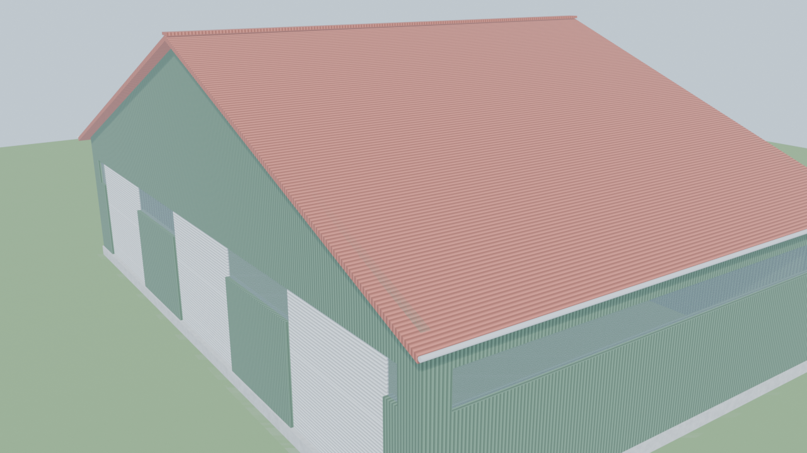
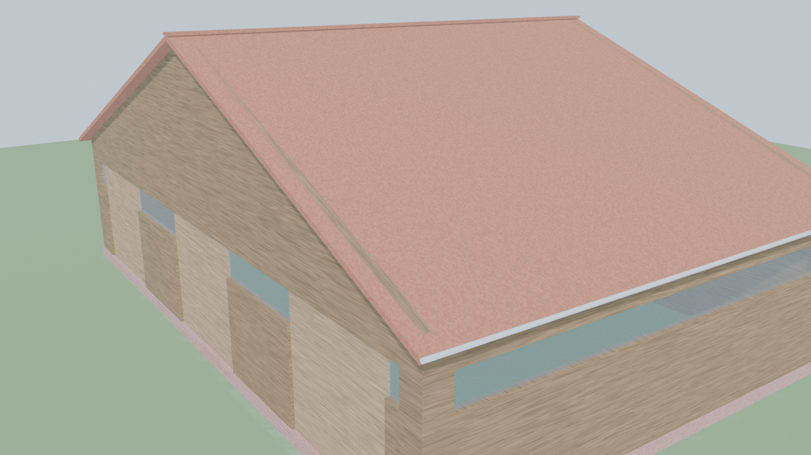
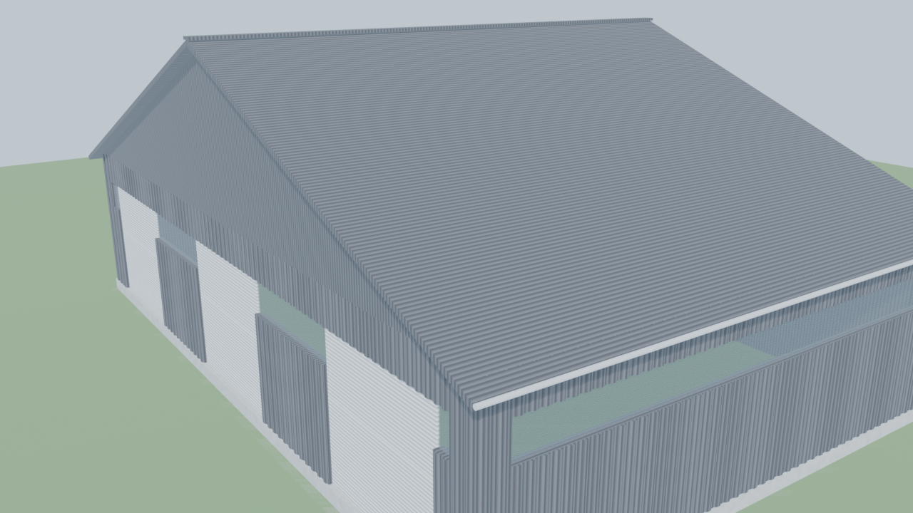

# FS25 Halle Generator

Parametric Maschinenhalle (machine hall) generator for Farming Simulator 25.
A Blender add-on that builds complete, configurable storage and workshop
buildings ready for export to GIANTS Editor.

[](LICENSE)
[](https://www.blender.org/)
[](https://www.farming-simulator.com/)



## What it does

You set dimensions, pick a roof type, choose materials per side, and click
**Halle generieren**. The add-on produces a clean Blender collection with
named objects, FS25-friendly material naming, sectional door panels with
their own origins (ready for animation), and optional 3D corrugation
geometry on metal sheet walls.

## Features

### Building shape

- Three roof types: gable (Satteldach), flat (Flachdach),
  shed / lean-to (Pultdach / Schleppdach)
- Configurable pitch, eave overhang, gable overhang, roof thickness
- Wall height and thickness, footprint dimensions
- Concrete plinth (Sockel) with adjustable height and offset
- Floor slab with overhang
- Internal support columns

### Openings

- Doors on all four sides simultaneously, with per-side count
- Sectional doors split into N panels (default 5), each with origin at the
  panel base for FS25 / GIANTS Editor animation
- Continuous Lichtbänder (light strips) on any side, with adjustable height,
  position, and corner margin

### Materials and styles

- 16 wall styles: Trapezblech (6 colors), Sandwichpanel (2), Holz (4),
  Sichtbeton, Klinker (2), Riffelblech
- 9 roof styles: Trapezblech, Stehfalz Zink and Kupfer, Tonziegel, Riffelblech
- 8 door styles, 7 plinth styles
- Per-side wall styles: every wall can be a different material
- Procedural shader nodes generate realistic previews without external
  textures (Wave for trapez stripes, Brick for clinker, Voronoi for
  Riffelblech diamond pattern, Noise for wood grain and concrete)
- Material names embed the style key (`Halle_Wall_WOOD_DARK`) so they survive
  I3D export with intent intact

### Geometry detail

- Optional 3D Trapezblech profile: real corrugation geometry as a skin
  overlay, only on TRAPEZ-styled walls. About 2300 extra faces per wall set.
- Eaves gutters (Dachrinnen) on sloped roofs
- Ridge cap (Firstziegel) on gable roofs
- Planar UV projection per face

| Wood walls with clay tile roof | 3D Trapezblech profile (visible corrugation) |
| --- | --- |
|  |  |

### Interior details

Optional fixtures placed at sensible positions inside the hall:

- Werkbank with vise and tool storage shelf
- Werkzeugwand (tool board)
- Hofdiesel-Tank on four legs with pump on top
- Druckluft-Kompressor with motor housing
- Feuerlöscher with wall mount

## Requirements

- Blender 4.0 or newer (4.2+ uses the new extension system, supported via
  `blender_manifest.toml`)
- For FS25 export: GIANTS I3D Exporter add-on (separate install from the
  GIANTS Developer Network)

## Installation

### Blender 4.2 and newer (recommended)

1. Download the latest `fs25_halle_generator-*.zip` from the
   [Releases](../../releases) page
2. In Blender: `Edit > Preferences > Get Extensions`
3. Click the dropdown menu (top-right of the extensions panel) and choose
   **Install from Disk...**
4. Pick the downloaded zip
5. The add-on appears under `FS25 Halle` in the 3D viewport sidebar (press N)

Drag and drop also works: drag the zip onto the running Blender window.

### Blender 4.0 and 4.1

1. Download the zip from Releases
2. `Edit > Preferences > Add-ons > Install...`
3. Pick the zip and tick the checkbox to enable

### Manual installation (always works)

If the install dialog misbehaves, copy the inner `fs25_halle_generator/`
folder into your Blender add-ons directory:

- Windows: `%APPDATA%\Blender Foundation\Blender\<version>\scripts\addons\`
- Linux: `~/.config/blender/<version>/scripts/addons/`
- macOS: `~/Library/Application Support/Blender/<version>/scripts/addons/`

Then restart Blender and enable the add-on in Preferences.

## Usage

1. Open Blender, press **N** in the 3D viewport, switch to the
   **FS25 Halle** tab
2. Set dimensions in the Hauptmaße section
3. Pick a roof type and pitch
4. Configure doors, windows, columns, plinth as needed
5. Pick wall, roof, door, and plinth styles in **Stil und Farbe**
6. Click **Halle generieren**

The add-on creates a collection (default name `Halle`) populated with named
objects. Re-running the operator clears and rebuilds the collection, so you
can iterate freely.

For FS25 export: select the collection contents, run the GIANTS I3D Exporter,
open the resulting `.i3d` in GIANTS Editor, and assign User Attributes
(`movingPart` for door panels, collision flags as needed).

## Project structure

```
fs25_halle_generator/
  __init__.py           Registration, bl_info
  blender_manifest.toml Extension manifest (Blender 4.2+)
  presets.py            Material preset tables and pattern keys
  properties.py         PropertyGroup with all settings
  materials.py          Procedural shader builders, UV mapping
  geometry.py           Walls, roofs, doors, windows, plinth, gutters,
                        columns, 3D trapez skin
  details.py            Workbench, tank, compressor, tool wall,
                        fire extinguisher
  generator.py          Main orchestrator
  operators.py          Generate / Clear operators
  ui.py                 Sidebar panel
make_zip.py             Build script: produces installable zip
test_addon.py           Headless smoke test (8 configurations)
```

## Building from source

```
python make_zip.py
```

Output: `fs25_halle_generator-<version>.zip` next to the source folder.

## Running tests

```
"path/to/blender.exe" --background --python test_addon.py
```

The test creates 8 configurations covering every roof type, door layout,
style preset, per-side wall mix, and the 3D trapez profile. Material
naming and color values are verified.

## Roadmap

See [ROADMAP.md](ROADMAP.md) for planned phases. Six roadmap phases cover
polish, FS25 integration, more styles, outdoor details, indoor atmosphere,
and tooling.

## Contributing

Issues and pull requests are welcome. For larger features, please open an
issue first to align on scope. Commits should use clear, descriptive
messages and respect the existing code style (4-space indent, snake_case,
module-level constants in UPPER_SNAKE).

## License

GPL-2.0-or-later. See [LICENSE](LICENSE).

This add-on is independent fan work and is not affiliated with or endorsed
by GIANTS Software, Blender Foundation, or any other entity.
